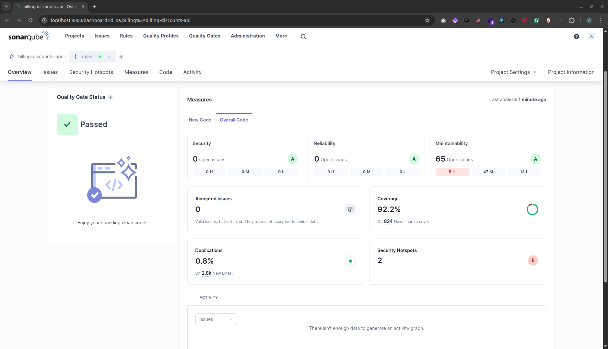

# Billing Discounts API


A Spring Boot application that calculates bill discounts for retail customers. The system handles different customer types and applies appropriate discounts based on business rules.

## Overview

This project follows **Domain-Driven Design (DDD)** principles to keep business logic separate from infrastructure concerns. The discount calculation uses the **Strategy Design Pattern** to dynamically handle different customer types and their specific discount rules, making the system flexible and easy to extend.

## Key Features

-   **Dynamic Discount Calculation**: Applies discounts based on customer type (Employee, Affiliate, Loyalty) using the Strategy pattern.
-   **Layered Discounts**: Calculates both percentage-based and flat bill-based discounts.
-   **DDD Architecture**: A clean, domain-focused structure separating business logic from infrastructure.
-   **Containerized Environment**: Easy setup and deployment with Docker and Docker Compose.
-   **Comprehensive Tooling**: Includes support for testing, code coverage (JaCoCo), and static analysis (SonarQube).

## Business Rules

The system applies discounts based on the following rules:

### 1. Percentage-Based Discounts
A customer is eligible for **only one** of the following percentage-based discounts on all non-grocery items in their bill:
-   **Employee**: Receives a 30% discount.
-   **Affiliate**: Receives a 10% discount.
-   **Loyal Customer**: A customer for over two years receives a 5% discount.
-   **Regular Customer**: Not eligible for a percentage-based discount.

### 2. Bill-Wide Discount
A flat discount is applied to the total bill amount.
-   For every $100 on the bill, a $5 discount is given.

### 3. General Rules
-   Percentage-based discounts **do not apply** to items in the "GROCERY" category.
-   The system automatically applies the single most beneficial percentage discount for the customer.

## High-Level Architecture (DDD)

The application is divided into four main layers, following DDD principles. The diagram below illustrates the dependency flow between these layers.

<div align="center">


*Caption: A diagram showing the layered architecture of the application.*

</div>

-   **Presentation**: Handles API requests and responses (`/presentation`).
-   **Application**: Orchestrates the business logic (`/application`).
-   **Domain**: Contains the core business models, rules, and logic (`/domain`).
-   **Infrastructure**: Manages external concerns like database interactions and configuration (`/infrastructure`).


## UML Class Diagram

<div align="center">


*Caption: A detailed UML class diagram showing the relationships between all major components of the application.*

</div>

## Technologies Used

-   **Java 17**
-   **Spring Boot 3.2**
-   **MongoDB** for the database.
-   **Maven** for dependency management.
-   **Docker** for containerization.
-   **JUnit 5 & Mockito** for testing.
-   **JaCoCo** for code coverage.
-   **SonarQube** for code quality analysis.

<<<<<<< Updated upstream
=======
## Deployment

This project is automatically deployed to **Google Cloud Run** using **Terraform**.

The live application can be accessed at: **[https://billing-discounts-api-36462279645.us-central1.run.app](https://billing-discounts-api-36462279645.us-central1.run.app)**

The health of the production deployment can be checked at the `/actuator/health` endpoint.

>>>>>>> Stashed changes
## Getting Started

### Prerequisites

-   Java 17+
-   Maven 3.8+
-   Docker & Docker Compose

### How to Run the Project

1.  **Clone the repository**:
    ```bash
    git clone git@github.com:anqorithm/billing-discounts-api.git
    cd billing-discounts-api
    ```

2.  **Start the development environment** (MongoDB and Mongo Express):
    ```bash
    make dev-setup
    ```

3.  **Run the application**:
    ```bash
    make run
    ```

The application will be available at `http://localhost:8080`.

### Running with Docker

To start all services (application, database, etc.) in Docker containers:

```bash
make docker-up
```

To stop all running containers:

```bash
make docker-down
```

## API Endpoints

The main endpoint calculates the final bill after applying discounts.

**Endpoint**: `POST /api/v1/bills/calculate`

### Scenario 1: Employee Discount

Request for an employee purchasing a laptop and a t-shirt.

**Request**:
```json
{
  "customerId": "65a1b2c3d4e5f6a7b8c9d0e1",
  "items": [
    { "productId": "65a1b2c3d4e5f6a7b8c9d0f1", "quantity": 1 },
    { "productId": "65a1b2c3d4e5f6a7b8c9d0f3", "quantity": 2 }
  ]
}
```

**Response**:
*   **Subtotal**: ($1500 * 1) + ($25 * 2) = $1550
*   **Percentage Discount (30% on $1550)**: $465
*   **Bill Discount ($5 per $100 on $1550)**: $75
*   **Net Amount**: $1550 - $465 - $75 = $1010

```json
{
    "status": "success",
    "data": {
        "customerId": "65a1b2c3d4e5f6a7b8c9d0e1",
        "items": [
            {"productId": "65a1b2c3d4e5f6a7b8c9d0f1", "quantity": 1, "unitPrice": 1500.00, "totalPrice": 1500.00},
            {"productId": "65a1b2c3d4e5f6a7b8c9d0f3", "quantity": 2, "unitPrice": 25.00, "totalPrice": 50.00}
        ],
        "subtotal": 1550.00,
        "percentageBasedDiscount": 465.00,
        "billBasedDiscount": 75.00,
        "totalDiscount": 540.00,
        "netAmount": 1010.00
    }
}
```

### Scenario 2: Affiliate Discount (with Groceries)

Request for an affiliate purchasing a book and some apples (groceries).

**Request**:
```json
{
  "customerId": "65a1b2c3d4e5f6a7b8c9d0e2",
  "items": [
    { "productId": "65a1b2c3d4e5f6a7b8c9d0f4", "quantity": 1 },
    { "productId": "65a1b2c3d4e5f6a7b8c9d0f2", "quantity": 10 }
  ]
}
```

**Response**:
*   **Subtotal**: ($45 * 1) + ($5.99 * 10) = $104.9
*   **Percentage Discount (10% on $45, groceries excluded)**: $4.5
*   **Bill Discount ($5 per $100 on $104.9)**: $5
*   **Net Amount**: $104.9 - $4.5 - $5 = $95.4

```json
{
    "status": "success",
    "data": {
        "customerId": "65a1b2c3d4e5f6a7b8c9d0e2",
        "items": [
            {"productId": "65a1b2c3d4e5f6a7b8c9d0f4", "quantity": 1, "unitPrice": 45.00, "totalPrice": 45.00},
            {"productId": "65a1b2c3d4e5f6a7b8c9d0f2", "quantity": 10, "unitPrice": 5.99, "totalPrice": 59.90}
        ],
        "subtotal": 104.90,
        "percentageBasedDiscount": 4.50,
        "billBasedDiscount": 5.00,
        "totalDiscount": 9.50,
        "netAmount": 95.40
    }
}
```

### Scenario 3: Regular Customer (No Percentage Discount)

Request for a regular customer (tenure < 2 years) with a bill over $100.

**Request**:
```json
{
  "customerId": "65a1b2c3d4e5f6a7b8c9d0e4",
  "items": [
    { "productId": "65a1b2c3d4e5f6a7b8c9d0f3", "quantity": 5 }
  ]
}
```

**Response**:
*   **Subtotal**: ($25 * 5) = $125
*   **Percentage Discount**: $0 (not eligible)
*   **Bill Discount ($5 per $100 on $125)**: $5
*   **Net Amount**: $125 - $5 = $120

```json
{
    "status": "success",
    "data": {
        "customerId": "65a1b2c3d4e5f6a7b8c9d0e4",
        "items": [
            {"productId": "65a1b2c3d4e5f6a7b8c9d0f3", "quantity": 5, "unitPrice": 25.00, "totalPrice": 125.00}
        ],
        "subtotal": 125.00,
        "percentageBasedDiscount": 0.00,
        "billBasedDiscount": 5.00,
        "totalDiscount": 5.00,
        "netAmount": 120.00
    }
}
```

### Scenario 4: Error Handling (Invalid Customer)

Request with a `customerId` that does not exist.

**Request**:
```json
{
  "customerId": "invalid-customer-id",
  "items": [
    { "productId": "65a1b2c3d4e5f6a7b8c9d0f1", "quantity": 1 }
  ]
}
```

**Response**:
```json
{
    "status": "error",
    "message": "Customer not found with ID: invalid-customer-id",
    "timestamp": "2025-09-01T10:00:00Z"
}
```

## Testing and Quality

### Unit & Integration Tests
-   **Run all tests**:
    ```bash
    make test
    ```
-   **Generate code coverage report**:
    ```bash
    make test-coverage
    ```
    The report is available at `target/site/jacoco/index.html`.

    <div align="center">

    

    *Caption: JaCoCo code coverage report showing 87% overall coverage.*

    </div>

### API Testing with .http file

You can use the [api-requests.http](api-requests.http) file with a compatible REST client (like the VS Code REST Client extension) to send test requests to the API endpoints.

### Code Analysis
-   **Run SonarQube analysis**:
    ```bash
    make sonar-run
    ```
    <div align="center">

    

    *Caption: SonarQube code quality analysis dashboard.*

    </div>

## Development Services

-   **API Docs (Swagger UI)**: [http://localhost:8080/swagger-ui.html](http://localhost:8080/swagger-ui.html)
-   **Application Health**: [http://localhost:8080/actuator/health](http://localhost:8080/actuator/health)
-   **Mongo Express**: [http://localhost:8081](http://localhost:8081) (Username: `admin`, Password: `admin123`)
-   **SonarQube Dashboard**: [http://localhost:9000](http://localhost:9000)

## Screenshots

<div align="center">


*Caption: Swagger UI showing available API endpoints.*

</div>

```json
{
  "status": "UP",
  "components": {
    "diskSpace": {
      "status": "UP",
      "details": {
        "total": 1006668316672,
        "free": 820512948224,
        "threshold": 10485760,
        "path": "/home/abdullah/Desktop/billing-discounts-api/.",
        "exists": true
      }
    },
    "mongo": {
      "status": "UP",
      "details": {
        "maxWireVersion": 25
      }
    },
    "ping": {
      "status": "UP"
    },
    "ssl": {
      "status": "UP",
      "details": {
        "validChains": [],
        "invalidChains": []
      }
    }
  }
}
```

*Caption: Spring Boot Actuator health endpoint response.*

## Author

- **Abdullah Alqahtani** - [anqorithm@protonmail.com](mailto:anqorithm@protonmail.com)

## License

This project is licensed under the MIT License - see the [LICENSE](LICENSE) file for details.
